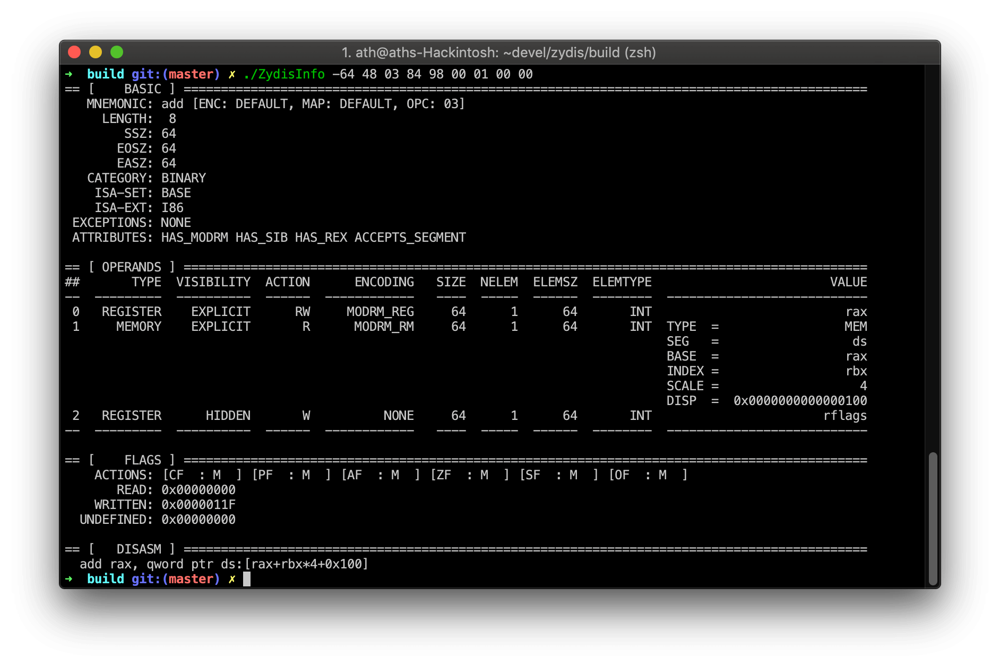

[](https://opensource.org/licenses/MIT) [](https://gitter.im/zyantific/zydis?utm_source=badge&utm_medium=badge&utm_campaign=pr-badge&utm_content=body_badge) [](https://discord.gg/pJaSX3n) [](https://ci.appveyor.com/project/athre0z/zydis/branch/master)

Fast and lightweight x86/x86-64 disassembler library.

## Features

- Supports all x86 and x86-64 (AMD64) instructions and [extensions](./include/Zydis/Generated/EnumISAExt.h)
- Optimized for high performance
- No dynamic memory allocation ("malloc")
- Thread-safe by design
- Very small file-size overhead compared to other common disassembler libraries
- [Complete doxygen documentation](https://zydis.re/doc/3/)
- Absolutely no third party dependencies — [not even libc](https://github.com/zyantific/zydis/blob/develop/CMakeLists.txt#L32)
  - Should compile on any platform with a working C99 compiler
  - Tested on Windows, macOS, FreeBSD and Linux, both user and kernel mode

## Quick Example

The following example program uses Zydis to disassemble a given memory buffer and prints the output to the console ([more examples here](./examples/)).

```C
#include <stdio.h>
#include <inttypes.h>
#include <Zydis/Zydis.h>

int main()
{
    ZyanU8 data[] =
    {
        0x51, 0x8D, 0x45, 0xFF, 0x50, 0xFF, 0x75, 0x0C, 0xFF, 0x75,
        0x08, 0xFF, 0x15, 0xA0, 0xA5, 0x48, 0x76, 0x85, 0xC0, 0x0F,
        0x88, 0xFC, 0xDA, 0x02, 0x00
    };

    // Initialize decoder context
    ZydisDecoder decoder;
    ZydisDecoderInit(&decoder, ZYDIS_MACHINE_MODE_LONG_64, ZYDIS_ADDRESS_WIDTH_64);

    // Initialize formatter. Only required when you actually plan to do instruction
    // formatting ("disassembling"), like we do here
    ZydisFormatter formatter;
    ZydisFormatterInit(&formatter, ZYDIS_FORMATTER_STYLE_INTEL);

    // Loop over the instructions in our buffer.
    // The runtime-address (instruction pointer) is chosen arbitrary here in order to better
    // visualize relative addressing
    ZyanU64 runtime_address = 0x007FFFFFFF400000;
    ZyanUSize offset = 0;
    const ZyanUSize length = sizeof(data);
    ZydisDecodedInstruction instruction;
    while (ZYAN_SUCCESS(ZydisDecoderDecodeBuffer(&decoder, data + offset, length - offset,
        &instruction)))
    {
        // Print current instruction pointer.
        printf("%016" PRIX64 "  ", runtime_address);

        // Format & print the binary instruction structure to human readable format
        char buffer[256];
        ZydisFormatterFormatInstruction(&formatter, &instruction, buffer, sizeof(buffer),
            runtime_address);
        puts(buffer);

        offset += instruction.length;
        runtime_address += instruction.length;
    }
}
```

## Sample Output

The above example program generates the following output:

```asm
007FFFFFFF400000   push rcx
007FFFFFFF400001   lea eax, [rbp-0x01]
007FFFFFFF400004   push rax
007FFFFFFF400005   push qword ptr [rbp+0x0C]
007FFFFFFF400008   push qword ptr [rbp+0x08]
007FFFFFFF40000B   call [0x008000007588A5B1]
007FFFFFFF400011   test eax, eax
007FFFFFFF400013   js 0x007FFFFFFF42DB15
```

## Build

#### Unix

Zydis builds cleanly on most platforms without any external dependencies. You can use CMake to generate project files for your favorite C99 compiler.

```bash
git clone --recursive 'https://github.com/zyantific/zydis.git'
cd zydis
mkdir build && cd build
cmake ..
make
```

#### Windows

Either use the [Visual Studio 2017 project](./msvc/) or build Zydis using [CMake](https://cmake.org/download/) ([video guide](https://www.youtube.com/watch?v=fywLDK1OAtQ)).

## `ZydisInfo` tool


## Bindings

 Official bindings exist for a selection of languages:
- [Rust](https://github.com/zyantific/zydis-rs)
- [Pascal](https://github.com/zyantific/zydis-pascal)

Inofficial but actively maintained bindings:
- [Python 3](https://github.com/novogen/pydis)
- [LuaJIT](https://github.com/Wiladams/lj2zydis)

## Credits
- Intel (for open-sourcing [XED](https://github.com/intelxed/xed), allowing for automatic comparision of our tables against theirs, improving both)
- [LLVM](https://llvm.org) (for providing pretty solid instruction data as well)
- Christian Ludloff (http://sandpile.org, insanely helpful)
- [LekoArts](https://www.lekoarts.de/) (for creating the project logo)
- Our [contributors on GitHub](https://github.com/zyantific/zydis/graphs/contributors)

## License

Zydis is licensed under the MIT license.
